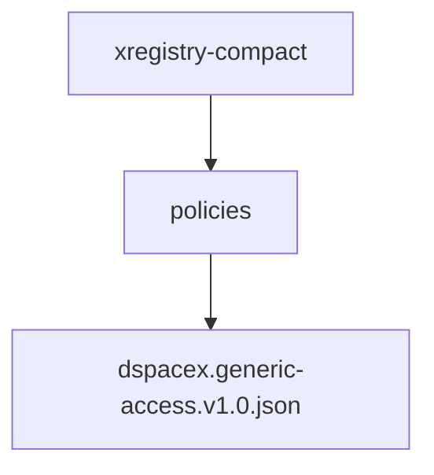
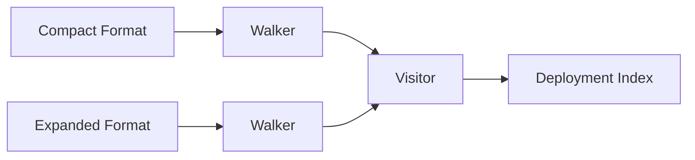
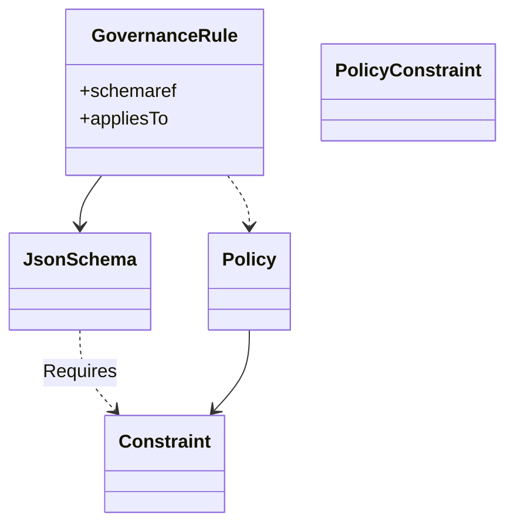
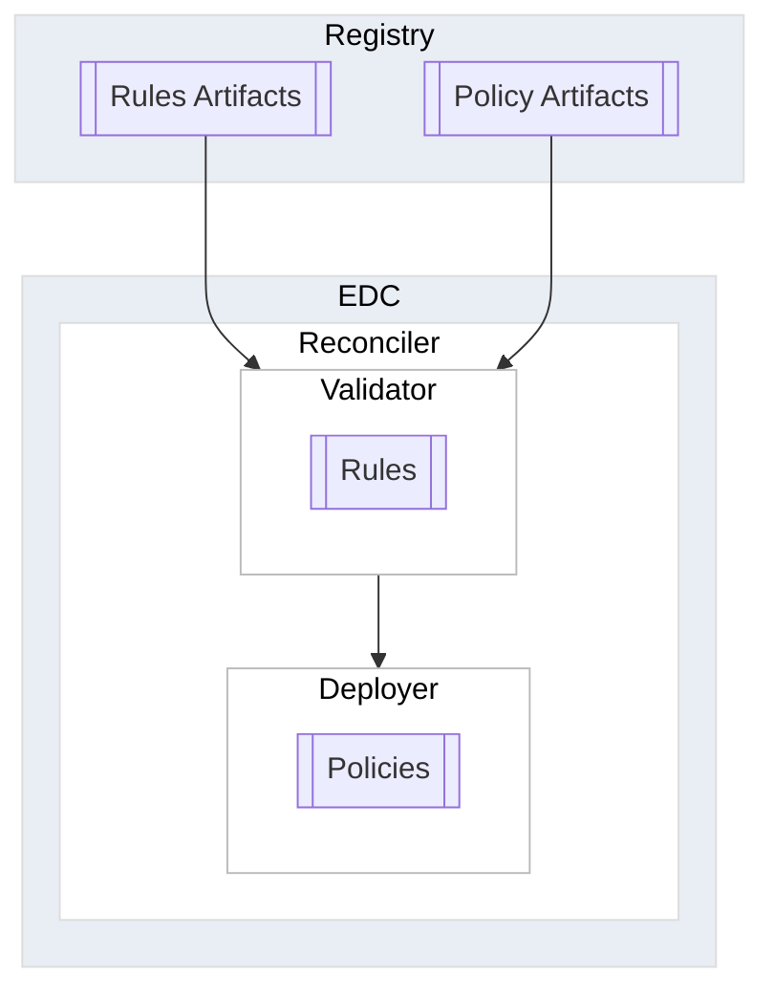

# EDC Fleet Coordination Architecture

This document outlines an architecture and implementation plan for the coordination of multiple Connector
deployments, termed _**Fleet Coordination**_. Note that the term `EDC` is used to refer to an EDC-based implementation
of the [Dataspace Protocol Specification (DSP)](https://github.com/eclipse-dataspace-protocol-base/DataspaceProtocol),
while `Connector` is used to refer to a generic implementation that may or may not be based on EDC.

## Problem Statement

Organizations may control multiple Connector deployments. For example, individual divisions may run their own EDC
instances
using [Management Domains](https://eclipse-edc.github.io/documentation/for-adopters/distributions-deployment-operations/#management-domains).
Other examples of multiple deployments include applications with embedded Connectors and
Connector service providers. The upshot of these heterogeneous environments is that organizations are faced with the
challenge of ensuring consistency and transparency across diverse deployments. For example, an organization may
want to enforce a compliance requirement that all data-sharing must adhere to a particular policy, regardless of the
Connector that enacts a particular data-sharing agreement. Similarly, an organization may want to track data-sharing
activities such as signed agreements across all Connector deployments.

We term all deployments under the control of a single organization a _**fleet**_. The concept of a fleet implies that a
particular deployment (ship) is operated autonomously (its crew) but in coordination (a fleet commander or admiral). The
problems of ensuring artifact consistency and event observability across deployments in a fleet is termed
_**fleet coordination**_.

### Example Scenarios

We will use the following example to explain concepts introduced in this document:

> Acme Corporation deploys a set of connectors in its own datacenters and also subscribes to a hosted service for
> sharing parts manufacturing data. The hosted service uses a highly customized EDC implementation.

### Fleet Coordination vs. Connector as a Service vs. Management Domains

Fleet Coordination differs from Connector as Service in that it is only concerned with maintaining consistency of
artifacts and the ability to receive events across Connector deployments belonging to a single organization. It is not
concerned with provisioning or operating those deployments. In contrast, Connector as a Service involves building
provisioning and operations infrastructure for Connectos that belong to multiple organizations.

Management domains enable an organization to delegate operational responsibility of EDC components throughout an
organization. For example, organizational subdivisions may elect to manage data sharing completely independently or
delegate some responsibilities such as operating data planes to other units. A deployment is therefore a management
domain, and we will use the two terms interchangeably.

Fleet coordination is a corollary to management domains. The latter allows an organization to present a unified
data catalog to external partners even though the contents may be served by independent Connectors. Fleet coordination
completes the picture by enabling unified control of key artifacts such as policies and schemas across management
domains.

## Problem 1: Consistency and Artifact Deployment

The problem of artifact deployment is summarized as follows:

> How are data-sharing resources coordinated across disparate applications and Connector runtimes in an organization?

These resources include:

- Access control policies
- Usage control policies
- Contract definitions
- Verifiable credential schemas
- Trust anchors

In the context of our example scenario, Acme Corporation wants to deploy policies and policy definitions across
connectors in their datacenter and to the hosted service.

One potential approach is to implement a push architecture based on a standardized API implemented by all
Connector distributions. Defining a common API is not practical given the diverse nature of Connector deployments. In
addition, it is overly complex. If each deployment adopted a common API, a coordinator would be needed to reliably push
changes to all Connector runtimes. This coordinator would have to be aware of all deployments (to push changes),
maintain state about those deployments (to know what to push), and support reliable delivery over a substantial period
of time(to handle the case where a deployment is unavailable or offline).

Rather, a loosely coupled approach has been chosen. Instead of a push model, fleet coordination will operate on a
declarative pull architecture similar to Kubernetes. Artifacts will be committed to a registry that can then be used to
calculate the desired deployment "state". It will be the responsibility of each deployment, or management domain, to
_**reconcile**_ the current state of its runtimes with the registry. This reconciliation process is depicted below:


This architecture has a number of benefits:

- There is no need for a standard management API.
- There is no need for central coordinator that has knowledge of all deployments. Each deployment is responsible for
  maintaining its own state calculated from the registry.
- There is no need for reliable delivery. If a deployment is unavailable or a new one comes online, it simply
  synchronizes its last known state against the current state of the registry.
- It integrates well with continuous delivery (CD) pipelines. Artifacts can be developed in repositories under version
  control and committed to the registry as part of a CD process.
- It scales up and down. As will be detailed, the registry can be a simple file-based implementation or a server
  allowing it to be used with single-instance or complex multi-cloud setups.

This architecture relies on the concept of eventual consistency. After changes have been pushed to the registry, there
will be an interval where changes are not applied uniformly to all deployments. The length of this interval depends on
the reconciliation cycle. Note, however, that this is no different from a push approach, which would also be subject to
a similar interval while all deployments are updated.

### xRegistry and OCI: A Standard Approach to Extensibility

The registry will implement
the [Open Container Initiative Distribution Specification (OCI)](https://github.com/opencontainers/distribution-spec)
and CNCF [xRegistry](https://github.com/xregistry/spec) specifications

As its name implies, xRegistry defines an extensible data model representing resources. These resources can be schemas,
message definitions, endpoint definitions, or other artifacts such as policies. The xRegistry specification also defines
an optional REST API for managing resources. However, we will not use the API and instead rely on OCI to
distribute resources.OCI defines an API for runtime artifact distribution supported by many open-source and commercial
registry products,
including [GitHub Packages](https://docs.github.com/en/packages/learn-github-packages/introduction-to-github-packages).
Kubernetes uses this API to deploy container images. In recent years, the capabilities of OCI registries have been
expanded from distributing runtime container images (e.g., Docker) to supporting arbitrary content. This has lead to
many deployment tools,
including [Helm](https://helm.sh/docs/topics/registries/), [Config Sync](https://cloud.google.com/blog/products/containers-kubernetes/gitops-with-oci-artifacts-and-config-sync), [Flux](https://fluxcd.io/flux/cheatsheets/oci-artifacts/), [timoni](https://timoni.sh/#oci-artifacts), [Crossplane](https://docs.crossplane.io/latest/packages/configurations/),
and [Tekton](https://github.com/tektoncd/community/blob/main/teps/0005-tekton-oci-bundles.md), to leverage OCI
registries for artifact distribution.

We will adopt the OCI API to distribute xRegistry content to EDC runtimes via the EDC reconciler. This provides several
benefits, including the ability to use existing tools and infrastructure for distributing artifacts and avoiding the
need for an additional xRegistry server. Note that using an xRegistry API server to distribute content will still be
possible. The advantages of using OCI registries for artifact distribution are
explored [here](https://itnext.io/advantages-of-storing-configuration-in-container-registries-rather-than-git-b4266dc0c79f)
and [here](https://www.bretfisher.com/oci-artifacts/).

Since xRegistry defines a model for storing schemas and other definitions, it can be used to manage additional
resources such as Verifiable Credential schemas, message schemas, and trust lists.

### Artifact Deployment Implementation

The OCI support and a Reconciler will be maintained in the EDC project since it is generally applicable to all
dataspaces.

**File System Format**

To support distributing xRegistry via an OCI registry as an artifact, we will define two file-system xRegistry layouts: a full-form version and a compact format that avoids boilerplate. The xRegistry file image can be ZIPed and pushed to an OCI registry, where it is available to deployments.

**Governance Rules**

We also introduce governance rule artifacts, which are meta-constraints for a category of policies. For example, a governance rule may be applied to policies for a particular dataspace that requires a membership credential.

#### OCI Registry Support

The workflow we are enabling is described in the following diagram:

```mermaid
flowchart LR
   subgraph gitrepo [Git Repository]
       direction LR
       policies[Policies]
       xregistry[xRegistry Format]
       tools[OCI Tools]
       policies --> xregistry
       xregistry --> tools
   end
   subgraph ocireg[OCI Registry]
       artifacts[[Artifacts]]
   end
   tools -- Publish --> artifacts
   edc1[EDC Deployment]
   edc2[EDC Deployment]
   artifacts -- Pull --> edc1
   artifacts -- Pull --> edc2
   style ocireg fill: #E9EDF4, stroke: #DDDDDD, stroke-width: 1px, color: #000000
   style gitrepo fill: #E9EDF4, stroke: #DDDDDD, stroke-width: 1px, color: #000000
  ```

In the developer-centric workflow, policies (and other content such as schemas) are authored using standard Git-aware tooling, such as an IDE. This content can be stored directly in the xRegistry file-system format or as resources elsewhere in the repository to facilitate development and testing alongside other components. If stored elsewhere, the xRegistry format can be generated during the build process. At that point, the build process can use standard OCI client tooling to create and publish the xRegistry archive to an OCI registry for deployment.    

The [ORAS project](https://github.com/oras-project) implements a popular OCI client library in multiple languages. The [Java variant](https://github.com/oras-project/oras-java) has been tested using the GitHub Packages OCI-compliant registry. A Gradle plugin will be provided that embeds the ORA client and automates this process.

This workflow can also be adapted to non-developer-centric workflows. For example, a GUI-based policy editor could check artifacts into a Git repository or deploy an archive directly to an OCI registry:


```mermaid
flowchart LR
   subgraph gitrepo [GUI Policy Editor]
       direction LR
       policies[Policies]
       tools[OCI Tools]
       policies --> tools
   end
   subgraph ocireg[OCI Registry]
       artifacts[[Artifacts]]
   end
   tools -- Publish --> artifacts
   edc1[EDC Deployment]
   edc2[EDC Deployment]
   artifacts -- Pull --> edc1
   artifacts -- Pull --> edc2
   style ocireg fill: #E9EDF4, stroke: #DDDDDD, stroke-width: 1px, color: #000000
   style gitrepo fill: #E9EDF4, stroke: #DDDDDD, stroke-width: 1px, color: #000000
  ```

It's important to note that since OCI registries are ubiquitous, no new production infrastructure is required to enable policy deployment.

#### The xRegistry File System Formats

The xRegistry specification envisions additional delivery mechanisms other than an API server. We define two file-system-based formats. The first specifies the following directory structure:

`[root]/[group type]/[group name]/[resource name]/[resource id]/versions/[version number].[ext]`

The following group types are supported

- policygroups
- schemagroups
- rulegroups

This structure is depicted for policies in the following diagram:

```mermaid
graph TD
   A[xregistry-expanded] --> B[xregistry.json]
   A --> C[policygroups]
   C --> D[dspacex]
   D --> E[meta.json]
   D --> F[policies]
   F --> G[generic-access]
   G --> H[meta.json]
   G --> I[versions]
   I --> J[1.0.json]
   
```


The above layout deploys the `generic-access` policy, version 1.0, under the `dspacex` group. The group and resource directories may contain `meta.json` documents containing additional xRegistry attributes. 

The same policy may be deployed in compact form using the following structure:

`[root]/policies/[file]`

where `[file]` is in the following format:

`[group].[resource].v[version].[ext]` 

For example, `dspacex.generic-access.v1.0.json`. This is depicted as follows:



Tooling has been developed that walks the expanded and compact directory structures, producing a `DeploymentIndex`.  The index can be used to perform validations (at build time) or create a `diff` for runtime deployment:



#### Governance Rules

A `Governance Rule` is a meta-constraint that is specified for a category of policies. For example:

> All policies used in Dataspace-X must require a Dataspace-X Membership Credential.

A governance rule is implemented as an xRegistry artifact that uses JSON Schema to define policy constraints and has an array of `appliesTo` values that specify the set of policies the rule is evaluated for. These relationships are modeled as follows:



A `GovernanceRule` references a JSON Schema that places requirements on a policy, specifically by defining the type of policy constraints that must be satisfied. Let's take the example of the Dataspace-X Membership Credential requirement. The governance rule is defined below:

```json
{
 "versionid": "1.0",
 "name": "membership-requirement",
 "description": "Requires Dataspace-X Membership Credential",
 "appliesTo": [
   "label:dspacex"
 ],
 "schemaref": "/schemagroups/dspace-x/membership/1.0"
}
```

The `appliesTo` value specifies that the rule applies to policies with the `label:dspacex` label. We will discuss labels in more detail later. For now, it's only important to know that groups of policies can be labeled.

The JSON Schema is defined as follows:

```json
{
 "$schema": "http://json-schema.org/draft-07/schema",
 "$description": "Requires a permission with action use have a headquarters in Europe",
 "type": "object",
 "properties": {
   "policy": {
     "type": "object",
     "properties": {
       "permission": {
         "type": "array",
         "items": {
           "type": "object",
           "properties": {
             "action": {
               "type": "string"
             },
             "constraint": {
               "oneOf": [
                 {
                   "$ref": "#/definitions/singleConstraint"
                 },
                 {
                   "type": "array",
                   "items": {
                     "$ref": "#/definitions/singleConstraint"
                   }
                 }
               ]
             }
           },
           "if": {
             "properties": {
               "action": {
                 "const": "use"
               }
             }
           },
           "then": {
             "anyOf": [
               {
                 "properties": {
                   "constraint": {
                     "allOf": [
                       {
                         "properties": {
                           "leftOperand": {
                             "const": "headquarter_location"
                           },
                           "rightOperand": {
                             "const": "EU"
                           }
                         }
                       }
                     ]
                   }
                 }
               },
               {
                 "properties": {
                   "constraint": {
                     "type": "array",
                     "contains": {
                       "properties": {
                         "leftOperand": {
                           "const": "membership.credential"
                         },
                         "rightOperand": {
                           "const": "active"
                         }
                       },
                       "required": [
                         "leftOperand",
                         "rightOperand"
                       ]
                     }
                   }
                 }
               }
             ]
           }
         }
       }
     }
   }
 },
 "definitions": {
   "singleConstraint": {
     "type": "object",
     "properties": {
       "leftOperand": {
         "type": "string"
       },
       "operator": {
         "type": "string"
       },
       "rightOperand": {
         "type": "string"
       }
     },
     "required": [
       "leftOperand",
       "operator",
       "rightOperand"
     ]
   }
 }
}
```

###### Labels

The previous section introduced governance rules and the `appliesTo` attribute. Labels are taken from the xRegistry resource name. For example, a policy named `dspacex.membership.v1.0` will be labeled `dspacex`.

#### Runtime Deployment

xRegistry resources are published to an OCI registry. The EDC reconciler will pull the resources from the registry and deploy them to a set of EDC runtimes. xRegistry resources are published as a ZIP archive containing the xRegistry file layout.

The following diagram illustrates the deployment process:



##### Rules and Policies: Separation of Concerns

There is no one correct way to organize all deployments. However, it is recommended to split policies and rules into separate repositories. This allows for a clear separation of concerns. The EDC reconciler can be configured to pull rules from a repository and apply them to policies distributed in different repositories.

##### Versioning

Both xRegistry and OCI containers have the concept of versions. The EDC deployment algorithm is not incremental, so the entire contents of the xRegistry will be evaluated on each reconciliation cycle. This means all active artifacts (e.g., policies) must be in the OCI archive, and artifacts that are not active must be omitted. For example, consider the following deployment states where policy v1 and v2 are deployed in two cycles, and v2 is subsequently deactivated in the third cycle:

| Cycle | OCI Archive Content  | Deployment State                          |
| ----- | -------------------- | ----------------------------------------- |
| 1     | policy v1            | policy v1 active                          |
| 2     | policy v1, policy v2 | policy v1 active, policy v2 active        |
| 3     | policy v2            | policy v2 active, [policy v1 deactivated] |

###### Policy Deactivation

Deleting a policy involved a number of considerations and is therefore not a straightforward task. If a contract agreement references a policy, the policy cannot be deleted. In addition, the reference from a contract agreement to a policy cannot be removed (for example, by "copying" the policy to the contract agreement) as it will then remove the possibility to determine which contract agreements have been created for a policy. A policy can only be deleted when there are no references to it.

Deletion is further complicated in fleet deployments. A policy may be referenced in one fleet deployment and not another. If deletion were allowed, this could result in an inconsistent state across the deployments. To avoid this possibility, we introduce the concept of policy deactivation. When a policy is removed from the OCI archive, it will be deactivated. Runtimes must retain the policy if it is referenced but not allow it to be used for new contract offers. If the policy is no longer referenced, it can be garbage collected and removed.


##### Implementation

An implementation of client-side OCI tooling has been done as part of this concept. We originally implemented a full OCI artifact generator in Java but later refined it to rely on the [ORAS Library](https://oras.land/). The ORAS library has been integrated with a Gradle plugin to make deploying policy artifacts from a Git repository as part of the standard build process simple. The following is an example build extract:

```kotlin
plugins {
   base
   id("org.eclipse.edc.xregistry-oci-publisher") version "1.0"
}

repositories {
   mavenCentral()
   mavenLocal()
}

configure<XRegistryOciPublisherExtension> {
   xRegistrySourceDir.set("src/main/xregistry")

   ociArtifactName.set("ghcr.io/metaform/xr-sample")
   ociArtifactTag.set("1.0")

   // Registry authentication
   ociRegistryUsername.set(
       System.getenv("OCI_REGISTRY_USERNAME")
           ?: throw GradleException("OCI_REGISTRY_USERNAME environment variable is required")
   )
   ociRegistryPassword.set(
       System.getenv("OCI_REGISTRY_PASSWORD")
           ?: throw GradleException("OCI_REGISTRY_PASSWORD environment variable is required")
   )

   // Custom manifest annotations
   manifestAnnotations.set(
       mapOf(
           "org.opencontainers.image.title" to "xRegistry Policy Bundle",
           "org.opencontainers.image.description" to "Fleet management policies",
           "org.opencontainers.image.version" to project.version.toString(),
           "org.opencontainers.image.created" to Instant.now().toString(),
           "org.opencontainers.image.authors" to "ACME, Inc."
       )
   )
}
```

Standard ORAS tooling can be used in place of the Gradle plugin, opening the possibility of deploying artifacts as part of GitHub actions, CI pipelines, and non-Java build systems.

In addition, a file system processor for xRegistry files has been completed. The reconciler component will use the processor to parse xRegistry OCI artifacts and apply them at runtime. Integration with the reconciler will be done in the next project phase.

### Reconciler Implementation

The Reconciler will be implemented as a sey of option EDC extensions that are deployed as a runtime to a management
domain. In a Kubernetes-based deployment, the Reconciler runtime can be configured as a `ReplicaSet` containing one pod.
Multiple pods are not needed since the Reconciler does not need to support high availability as it does not serve client
requests. If a Reconciler pod becomes inoperable, Kubernetes will redeploy the reconciler to another pod and operations
will continue as normal.

The Reconciler will periodically scan a set of configured xRegistry targets, calculate changes since its last scan, and
update the management domain. The Reconciler will record the update for its next run. Note that not all resources may be
updated transactionally. In this case, the reconciler will need to implement compensation logic to rollback committed
changes.

Returning to our example, both Acme Corporation and the hosting company will need to do two things:

- Configure connectors to use Acme's xRegistry server. The hosting company can do this by providing the option to enter
  a URL and API Key (or OAuth 2 credentials) for the xRegsitry.
- Deploy reconcilers that watch the xRegistry for changes. The hosting company may use the open-source reconcile or
  develop their own implementation.

## Problem 2: Observability and Activity Events

The problem of fleet transparency is defined as the following:

> How are data-sharing activity events observed across a fleet of Connectors?

There are two of key points packed into how this problem is framed.

### Activity Events vs. Telemetry

The first point is that events are defined as "data-sharing activity" and are distinct from telemetry. This is inline
with a core EDC design tenant that distinguishes between monitoring (information logging), software operations metrics (
telemetry), and events related to activities performed by the Connector. These three realms should not be mixed.

To understand why these distinctions were made, consider telemetry in two scenarios. If an organization has contracted
with a provider to run a Connector on its behalf (Connector as a Service), it should not be directly concerned with
specific telemetry. The organization may be interested in the overall quality of service of its Connector operations,
but specific data about particular runtime operations will not be relevant. This is particularly true in setups where
Connectors are virtualized by a service provider and run in a shared runtime instance. In fact, telemetry data will be
of little use to an organization not familiar with the implementation of the connector service.

Another example is where two Connectors implementations or different. Note this may be the case even when both
Connectors are implemented using EDC, as the latter supports a wide variety of deployment architectures. In these
situations, there will be limited similarity between the telemetry emitted by the two runtimes.

In contrast, data-sharing activity can be abstracted across divergent Connector implementations since these activities
are defined by DSP state machines. For example, a contract agreement being finalized or a data transfer being started or
paused.

### Activity Events as a Basis for Automation

The second point is that we are concerned with the observability of events, not querying data-sharing metrics. Fleet
coordination will provide facilities for receiving events, but it will not provide a way to querying metrics such
as the number of contract agreements signed over a period of time. The focus is on providing a basis for automation.
Events can be observed and compiled into metrics that are exposed as query endpoints by separate applications.
Event automation can be used to create novel metrics and solve problems posed by a diverse range of use cases as opposed
to a fixed set of indicators.

### CloudEvents: A Protocol Agnostic Message Standard

Activity events are designed to be protocol agnostic. In other words, it must be possible to transport these events over
multiple messaging providers such as an MQTT broker, Kafka, or a cloud messaging provider. Fleet coordination will adopt
the CNCF [CloudEvents specification](https://www.cncf.io/projects/cloudevents/) as it defines a protocol-independent
message format for events. An example cloud event is as follows:

```json
{
  "specversion": "1.0",
  "type": "EdcSampleEvent",
  "source": "….",
  "subject": "123",
  "id": "4ec892f6-9b58-4ead-862e-41c1ec5eaf11",
  "time": "2025-02-05T17:31:00Z",
  "datacontenttype": "applicationjson",
  "data": " {…}"
}
```

Cloud events will enable Connector deployments to send events and route events over a diverse range of messaging
systems. These events can then be received and acted upon by applications and other systems.

### Activity Events Implementation

An EDC implementation will be developed that builds on the existing low-level `EventRouter` to transform data passed
through it into Cloud Events. A set of events and schemas will also be defined for those transformations. Output sinks
to specific messaging systems such as Kafka will also be developed. The specific target message systems still needs to
be defined.

Returning to the example, Acme Corporation may choose to use EDC extensions to propagate events to a specific messaging
provider such as Kafka or AWS EventBridge. The hosting provider could offer the option for Acme to chose their message
destination of choice, for example, EventBridge, or another solution. Acme could then listen for events and forward them
to internal applications for processing.

## Fleet Coordination Architecture

Fleet Coordination capabilities will be developed as a set of EDC extensions consisting of the following:

- An xRegistry implementation that can be deployed as a server
- xRegistry tooling for integrating artifact publishing in automated CI pipelines
- A Reconciler runtime that synchronizes changes to a management domain
- A CloudEvent Router and transport bindings for publishing activity events

The above components can be incorporated into downstream projects as part of an EDC distribution. These components are
represented in the following architecture diagram:


